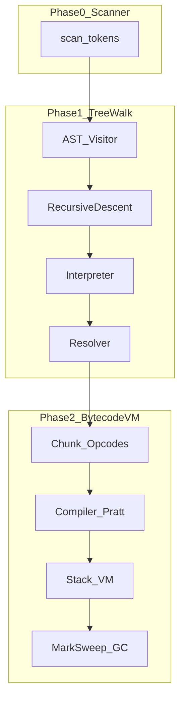

# jsmoteur 编译器 / 解释器开发路线图

> 对照 Robert Nystrom《Crafting Interpreters》Part II（树遍历）与 Part III（字节码 VM），在本仓库用 **Rust** 实现 **JavaScript 子集**。  
> 本文档是实现顺序与验收依据；不是书本摘要。

## 当前进度

| 阶段 | 状态 | 说明 |
|------|------|------|
| Phase 0 — Scanner MVP | **done** | [`src/lib/lexer.rs`](../../src/lib/lexer.rs)；缺口见 [TODO-scanner-tokens.md](../TODO-scanner-tokens.md) |
| Phase 1 — 树遍历解释器（Part II） | pending | [phase-1-treewalk.md](phase-1-treewalk.md) |
| Phase 2 — 字节码 VM（Part III） | pending | [phase-2-bytecode-vm.md](phase-2-bytecode-vm.md) |

## 双阶段策略（书中原则）

1. **正确先于快速** — Phase 1 建立完整语义（AST + Visitor 求值）；Phase 2 换执行模型追求性能。
2. **手写一切** — 不用 Lex/Yacc/ANTLR；Scanner / Parser / Compiler 手写，保证每行可理解。
3. **每章可运行** — 每完成一章能力，`cargo test` + `test/` 下样例可跑通对应子集。
4. **编译期多做、运行期少做** — Resolver、局部槽位、upvalue 解析等尽量静态完成。
5. **实现细节 ≠ 语言本身** — `bytecode`、`recursive descent` 是实现选择；用户只关心 JS 语义正确。

## 语言范围（JS 子集）

对齐仓库 [README.md](../../README.md)，Phase 1 目标：

| 纳入 | 延后 |
|------|------|
| `var` / `let` / `const` | 箭头函数、模板字符串 |
| 算术 / 比较 / 逻辑 / `===` | 正则字面量、`async`/`await` |
| `if` / `while` / `for` / `switch`（按章推进） | 完整 ES 模块、Proxy |
| 普通 `function`、闭包 | BigInt、装饰器 |
| `class` / 继承（Phase 1 末可选） | 完整原型链边角 |

书中语言是 **Lox**；本仓库映射为上述 JS 子集，框架名保留书中叫法（Recursive Descent、Pratt、Panic Mode、Upvalue 等）。

## 模块约定

| 模块 | 职责 | 阶段 |
|------|------|------|
| `token.rs` / `lexer.rs` / `symbol.rs` | Token + Scanner | Phase 0（已有）→ Phase 1 补齐 |
| `ast.rs` | AST + Visitor | Phase 1 |
| `parser.rs` | 递归下降 Parser | Phase 1 |
| `env.rs`（新建） | 运行时 Environment | Phase 1 |
| `interpreter.rs`（新建） | 树遍历求值 | Phase 1 |
| `resolver.rs`（新建） | 静态作用域绑定 | Phase 1 |
| `compiler.rs` | **字节码编译器**（勿与解释器混用） | Phase 2 |
| `chunk.rs` / `opcode.rs` / `value.rs` / `table.rs` / `vm.rs` / `gc.rs`（新建） | Chunk、VM、GC | Phase 2 |

Phase 2 完成后，Phase 1 的 `interpreter` 可保留作**语义对照 / 测试预言机**，不必删除。

## 书章节总对照

### Part II → Phase 1

| 书章节 | 主题 | 文档 |
|--------|------|------|
| Ch.4 Scanning | 词法（补齐） | [phase-1](phase-1-treewalk.md#ch4-scanning) |
| Ch.5 Representing Code | AST、Visitor | [phase-1](phase-1-treewalk.md#ch5-representing-code) |
| Ch.6 Parsing Expressions | Recursive Descent、Panic Mode | [phase-1](phase-1-treewalk.md#ch6-parsing-expressions) |
| Ch.7 Evaluating Expressions | 树遍历求值 | [phase-1](phase-1-treewalk.md#ch7-evaluating-expressions) |
| Ch.8 Statements and State | 语句、全局变量 | [phase-1](phase-1-treewalk.md#ch8-statements-and-state) |
| Ch.9 Control Flow | if / while / for | [phase-1](phase-1-treewalk.md#ch9-control-flow) |
| Ch.10 Functions | 函数与调用 | [phase-1](phase-1-treewalk.md#ch10-functions) |
| Ch.11 Resolving and Binding | Resolver、闭包绑定 | [phase-1](phase-1-treewalk.md#ch11-resolving-and-binding) |
| Ch.12–13 Classes / Inheritance | 类与继承（可选） | [phase-1](phase-1-treewalk.md#ch12-13-classes-inheritance-可选) |

### Part III → Phase 2

| 书章节 | 主题 | 文档 |
|--------|------|------|
| Ch.14 Chunks of Bytecode | Chunk / locality | [phase-2](phase-2-bytecode-vm.md#ch14-chunks-of-bytecode) |
| Ch.15 A Virtual Machine | 栈式 VM | [phase-2](phase-2-bytecode-vm.md#ch15-a-virtual-machine) |
| Ch.16 Scanning on Demand | 编译期扫描 | [phase-2](phase-2-bytecode-vm.md#ch16-scanning-on-demand) |
| Ch.17 Compiling Expressions | Pratt Parser | [phase-2](phase-2-bytecode-vm.md#ch17-compiling-expressions) |
| Ch.18–20 Types / Strings / Hash Tables | Value、字符串、表 | [phase-2](phase-2-bytecode-vm.md#ch18-20-types-strings-hash-tables) |
| Ch.21–24 Globals / Locals / Jumping / Calls | 编译与调用约定 | [phase-2](phase-2-bytecode-vm.md#ch21-24-globals-locals-jumping-calls) |
| Ch.25–26 Closures / Garbage Collection | Upvalue、Mark-Sweep | [phase-2](phase-2-bytecode-vm.md#ch25-26-closures-garbage-collection) |
| Ch.27–30 Classes… / Optimization | OOP + 优化（后期） | [phase-2](phase-2-bytecode-vm.md#ch27-30-classes-optimization-后期) |

## 相关文档

- [Scanner 未实现 Token TODO](../TODO-scanner-tokens.md)
- 在线书：《[Crafting Interpreters](https://craftinginterpreters.com/)》
